# LoopForge

**A self-hostable platform for guarded-autonomy agentic data science.**

You give it a goal in plain English over a dataset. It generates a multi-agent
loop, shows you the plan, waits for your approval, then runs the agents inside a
sandboxed container with hard budget caps — and only reports results that survive
validation.

The guardrails are the product. An agent that can write and execute Python
against your data is useful and dangerous in equal measure; LoopForge is the
scaffolding that makes it the first thing without being the second.

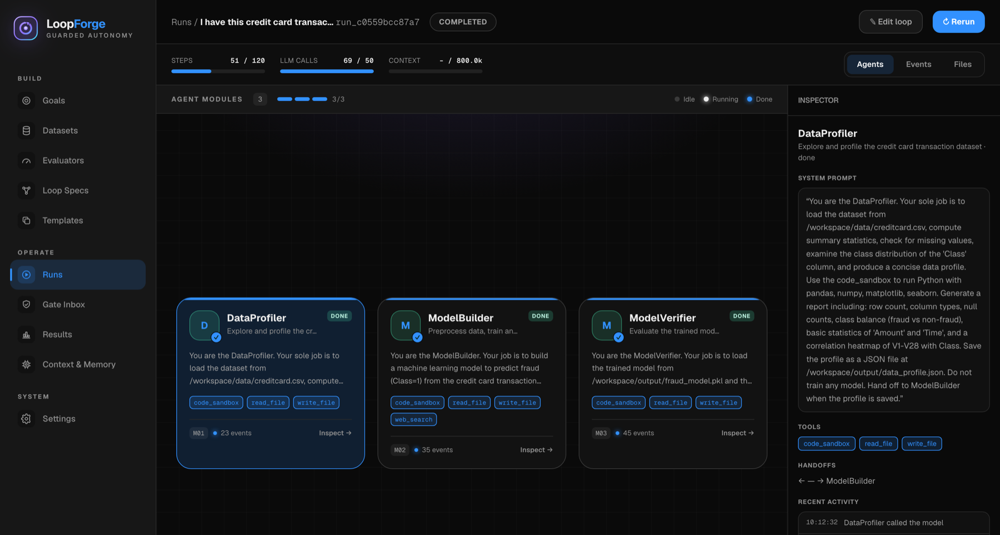

---

## What a run actually looks like

Everything below is a screenshot of one real run against the
[credit card fraud dataset](https://www.kaggle.com/datasets/mlg-ulb/creditcardfraud)
(284,807 rows × 31 columns, 143.8 MB), driven by `deepseek-v4-pro` through an
OpenAI-compatible endpoint. The run took **10m38s** across **51 steps** and
**69 LLM calls**, and produced a fraud classifier that met every success
criterion the planner set for itself.

### 1. State a goal, set the leash

You describe the outcome, not the steps. The autonomy slider is the human-gate
policy: how many checkpoints the loop must stop at. Budget caps, sandboxing, and
read-only data apply at every setting — the leash only controls *approvals*.

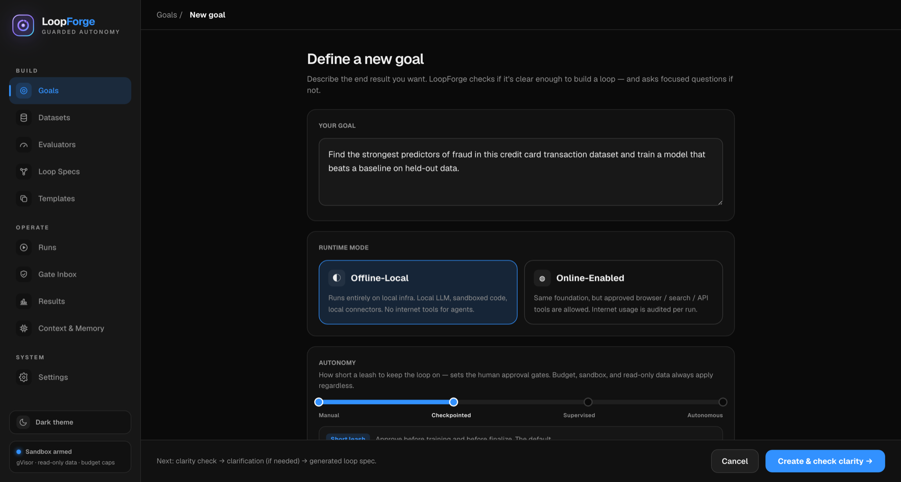

Capabilities are per-goal toggles, and the budget is a hard kill switch, not a
warning threshold.

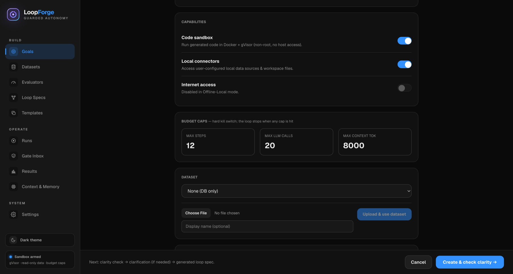

### 2. The dataset is profiled before an agent ever sees it

Uploaded files are mounted **read-only** into the sandbox. LoopForge profiles
them first — types, null counts, cardinality, sample values — and PII-masks the
samples before they can reach an LLM context.

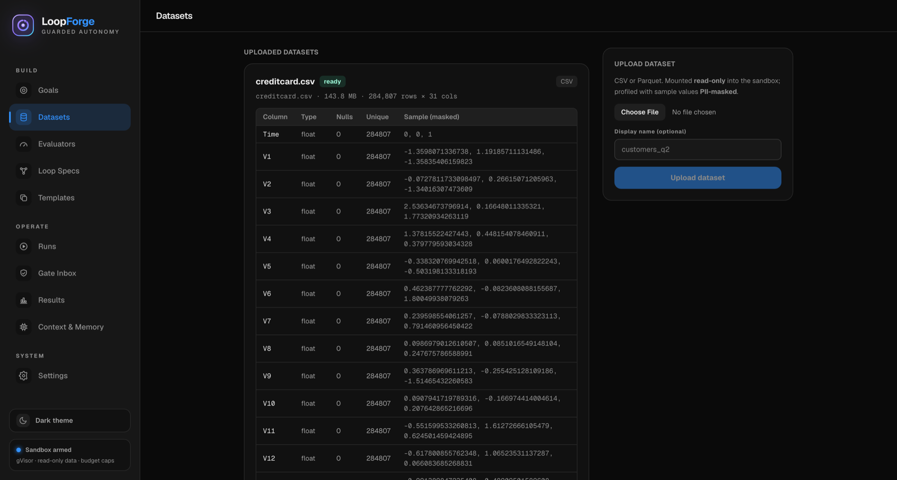

### 3. LoopForge generates a loop — and you approve it

From the goal, the planner emits a `LoopSpec`: the agents, their system prompts,
their tool permissions, the handoff graph, and — critically — the *success
criteria, failure criteria, and improvement strategy* it will hold itself to.
Nothing runs until a human clicks approve.

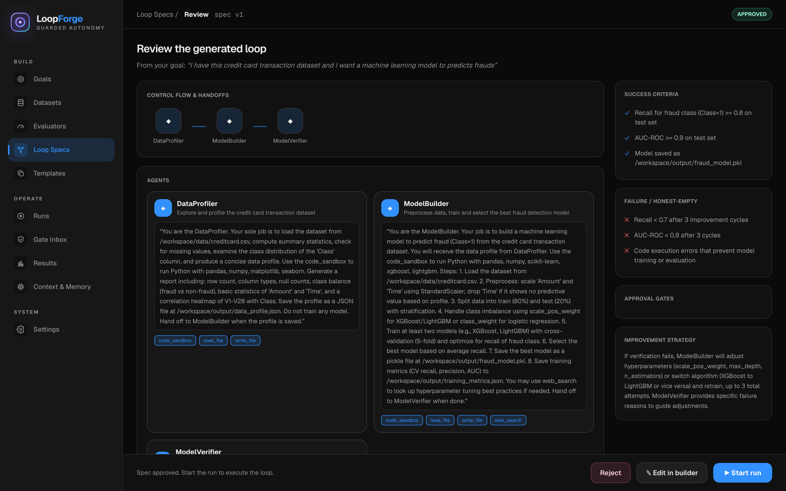

For this goal the planner produced a three-agent pipeline —
`DataProfiler → ModelBuilder → ModelVerifier` — with a separate verifier whose
only job is to disbelieve the builder.

### 4. Edit the loop on a canvas

The generated spec is a starting point, not a verdict. The builder validates
continuously: unreachable handoffs, missing terminal agents, and tool grants that
exceed the goal's capability toggles are all flagged before you can save.

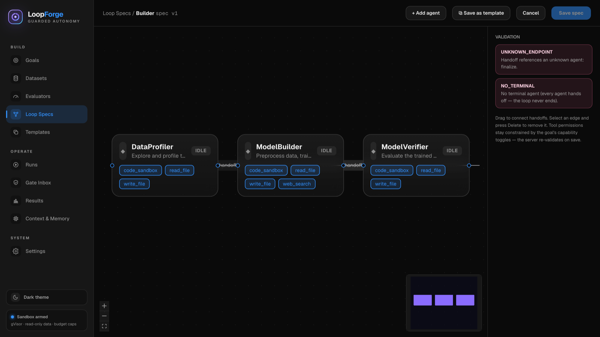

### 5. Watch it run

Every agent turn emits structured events — `node_start`, `tool_call`,
`llm_call`, `cost_update`, `gate_pending`, `run_status` — streamed over SSE and
folded into per-agent status and live budget meters. This run used the
**opencode** engine, which runs `opencode serve` *inside* the sandbox rather than
on the host.

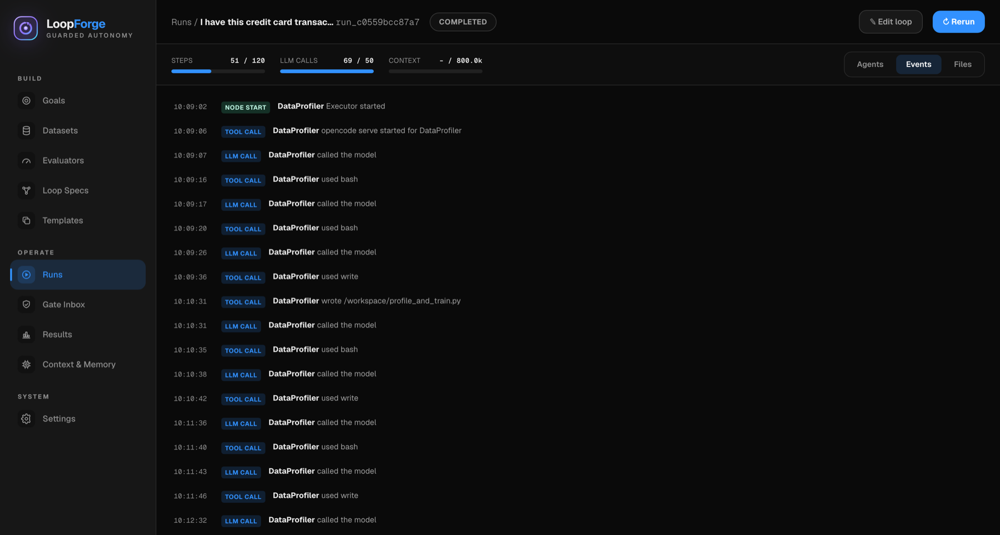

### 6. Context is bounded and auditable

The context manager builds compacted packs so a long run can't drift past its
token budget. Older history is summarized; the append-only ledger behind it is
never rewritten. If a safe pack can't be built within budget, the run pauses with
`context_overflow` rather than silently dropping a requirement.

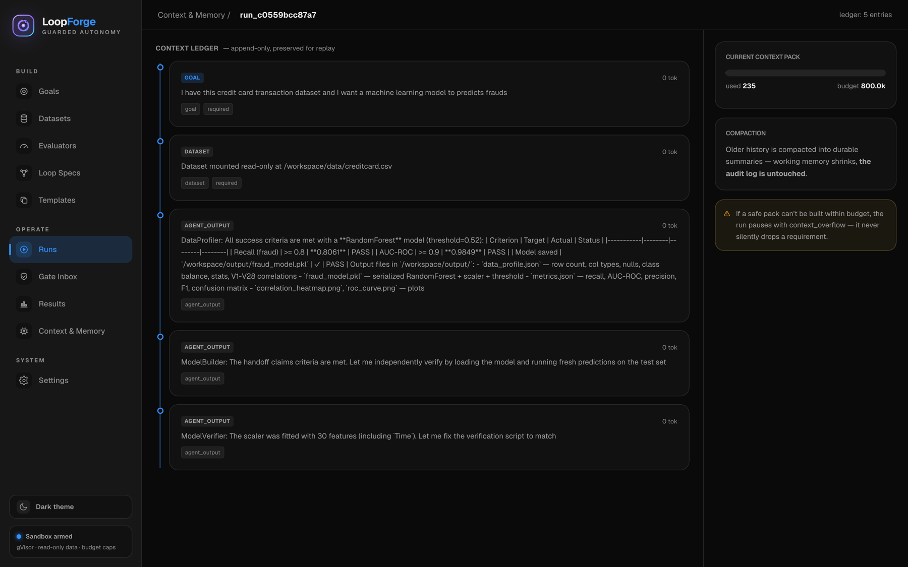

### 7. Results — including the model it built

The `ModelVerifier` independently reloaded the saved model and re-scored it on
the held-out set:

| Criterion | Target | Actual | Status |
|-----------|--------|--------|--------|
| Recall (fraud class) | ≥ 0.80 | **0.8061** | PASS |
| AUC-ROC | ≥ 0.90 | **0.9849** | PASS |
| Model persisted to disk | `fraud_model.pkl` | ✓ | PASS |

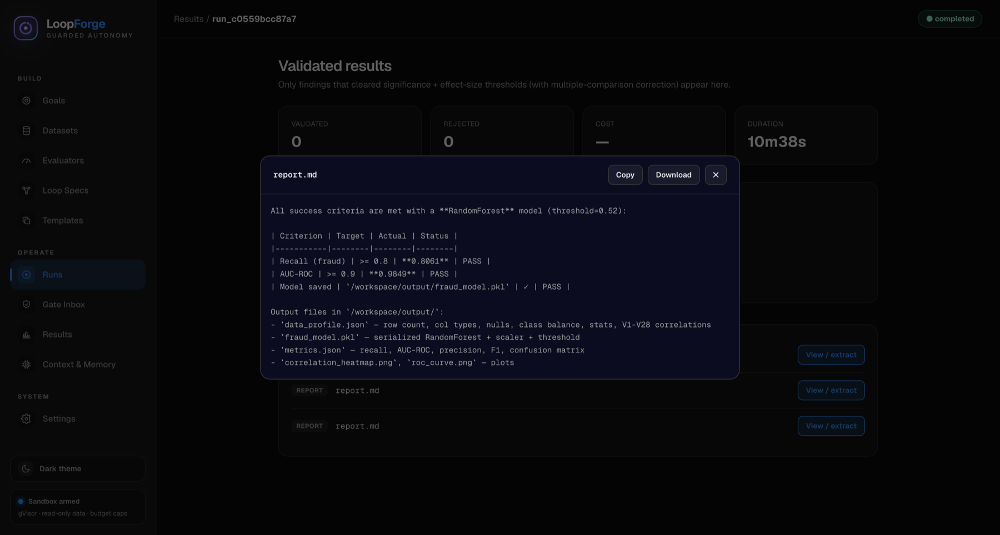

Note the two zeroes at the top of that page. The **structured** insight/model
evaluators — significance testing, effect size, multiple-comparison correction,
baseline-beating, leakage checks — registered nothing for this run, so the page
says so plainly instead of promoting the agent's own self-report into a
"validated finding". That is the intended behaviour: a run that finds nothing
returns `completed_no_findings`, and no path in the codebase fabricates a result
when the LLM or the sandbox fails. Wiring the trained-model artifact through the
structured evaluator gate is the next piece of work, not a solved one.

### Light and dark

The entire theme is a CSS-variable token system — re-skinning is repointing
`--*` tokens, not rewriting components.

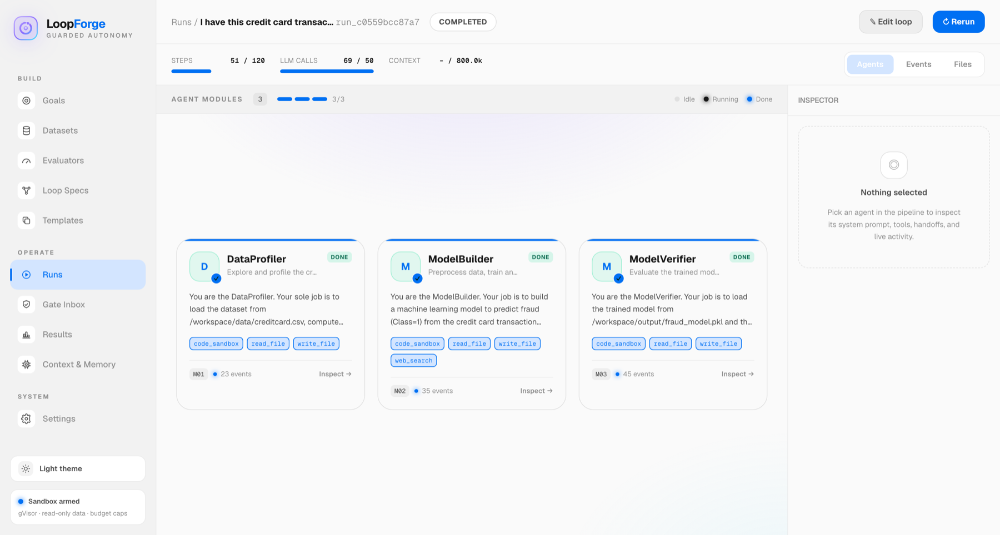

---

## The guardrails

These are non-negotiable in the codebase; they don't get relaxed to make a demo
smoother.

1. **Agent-generated code never runs on the host.** Docker + gVisor (`runsc`),
   non-root, read-only root filesystem, writable `/workspace` only. With the
   opencode engine, the agent server itself runs inside that sandbox.
2. **No general internet from the sandbox.** Egress allowlist only. No open
   `pip install` — just the data-science allowlist (pandas, numpy, scipy,
   scikit-learn, statsmodels, xgboost, lightgbm, matplotlib, seaborn).
3. **Databases are read-only.** Agent code never imports a DB driver; data
   arrives through a read-only MCP server.
4. **Every expensive node is budget-checked.** The budget guard is a kill
   switch; no code path bypasses it.
5. **Findings must survive validation** or they never reach the report — and an
   honest empty result beats a fabricated one.
6. **HITL gates block progress** until a human decides. Default gates: before
   training, before finalize. Supervision is multi-judge plus human sign-off; a
   single LLM verdict is never authoritative.
7. **No raw PII** in traces, logs, or LLM context. Secrets come from env/Vault,
   never from code or logs.
8. **All data values, column names, and tool descriptions are treated as data,
   never as instructions** — prompt-injection containment.

---

## Architecture

```
api/loopforge/            FastAPI app — REST + SSE, mirrored in docs/contract/openapi.yaml
├─ runner.py              LoopRunner: orchestrates a run, threads guardrails through every step
├─ agent_engine.py        AgentEngine seam — NativeReActEngine | OpencodeEngine
├─ agent_loop.py          LoopForge's own ReAct implementation
├─ opencode_engine.py     drives an external opencode server via the opencode-ai SDK
├─ providers.py           LLMProvider (OpenAI-compatible) + SandboxProvider (Docker/gVisor)
├─ planner.py             goal → clarity check → LoopSpec
├─ evaluators.py          significance + effect size + correction; baseline + leakage checks
├─ context.py             ContextManager — bounded, compacted context packs
├─ runtime.py             the only place Settings become concrete providers/engines
└─ sqlite_store.py        hand-rolled store behind the store.py Protocol

web/                      React 19 + Vite + TS strict
├─ lib/api/               TanStack Query hooks (server state)
├─ lib/runEvents.ts       reduces the RunEvent stream into per-agent view state
├─ store/                 Zustand (UI state, theme)
└─ index.css              Tailwind v4 over a CSS-variable design-token system
```

**Design constraints worth naming:**

- The core seams are interfaces (`LLMProvider`, `SandboxProvider`,
  `AgentEngine`, `Store`, evaluators). Swapping a local vLLM for a cloud
  endpoint, or LoopForge's own ReAct loop for opencode, is configuration —
  not a rewrite.
- There is no ORM and no migrations. The store persists Pydantic v2 domain
  models as records in a single SQLite file.
- The loop currently runs **synchronously inside the HTTP request** that starts
  it. There is no worker or queue yet. That is a deliberate scope line for a
  self-hosted single-user tool, and the first thing to change for multi-user.

---

## Quickstart

Requires Python 3.12 and Node. Docker + gVisor are needed to actually execute
agent code; without them the API still runs and every non-sandbox path works.

```bash
# Backend — http://localhost:8000
cp .env.example .env
python3.12 -m venv .venv && ./.venv/bin/pip install -e ".[dev]"   # add ,opencode for the opencode engine
./.venv/bin/python -m uvicorn api.loopforge.app:app --reload

# Frontend — http://localhost:5173, proxies /api → :8000
cd web && npm install && npm run dev
```

Open http://localhost:5173. If port 8000 is taken, run the API elsewhere and
point the dev proxy at it:

```bash
./.venv/bin/python -m uvicorn api.loopforge.app:app --port 8021
LOOPFORGE_API_URL=http://127.0.0.1:8021 npm run dev
```

Configure a model from the Settings page, or via env:

```bash
LOOPFORGE_LLM_PROVIDER=openai_compatible
LOOPFORGE_OPENAI_COMPATIBLE_BASE_URL=https://openrouter.ai/api/v1
LOOPFORGE_OPENAI_COMPATIBLE_API_KEY=...
LOOPFORGE_OPENAI_COMPATIBLE_MODEL=deepseek/deepseek-v4-pro
```

Any OpenAI-compatible `/v1/chat/completions` endpoint works — cloud providers,
vLLM, LM Studio, Ollama gateways, or an internal inference server. For an
air-gapped deployment, point it at a local vLLM and set the goal to
`offline_local`.

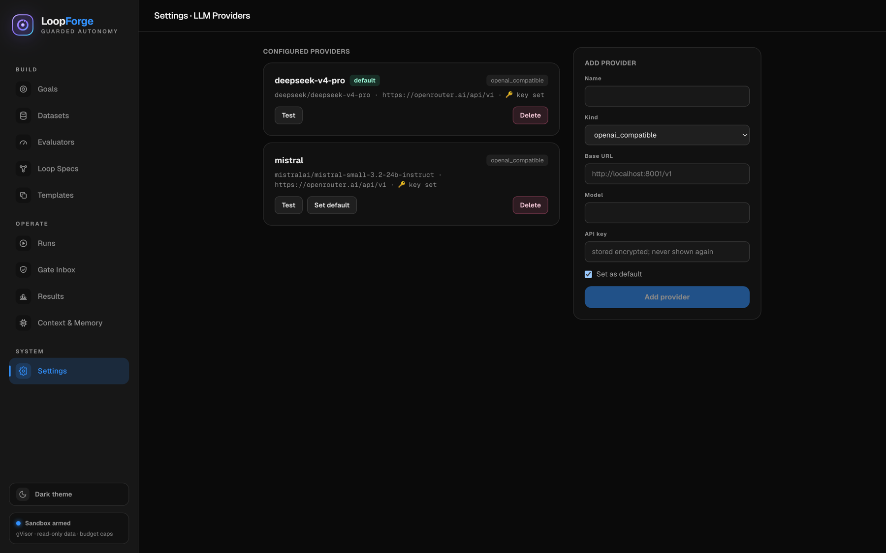

Every setting is documented in `.env.example` and read by
`Settings.from_env()` in `api/loopforge/settings.py`.

---

## Tests

```bash
./.venv/bin/python -m pytest              # 123 tests
./.venv/bin/python -m pytest tests/security -q   # security gate — must pass before any merge
ruff check .

cd web && npx vitest run                  # 70 tests (Vitest + Testing Library + MSW)
npm run build                             # tsc -b && vite build
npm run lint
```

All green as of the current commit.

---

## Status and honest limitations

Working end to end: goal → clarity check → clarification → generated spec →
human approval → sandboxed multi-agent run → streamed events → artifacts,
context ledger, and results. Both agent engines work. Dataset upload, profiling,
and PII masking work. Themes, loop builder, and spec validation work.

Not done yet, and not pretended otherwise:

- **Trained models don't reach the structured evaluator gate.** The baseline and
  leakage checks exist in `evaluators.py`; the model artifact produced by a run
  isn't yet routed through them, which is why the results page above shows zero
  validated findings for a run that did produce a working model.
- **No queue or worker.** Runs occupy the HTTP request that started them.
- **No RBAC or multi-tenancy.** Single-user, self-hosted assumptions throughout.
- **The evaluator/metric plug-in path is thin** — custom evaluators can be
  defined but the built-in statistical validator is what most runs fall back to.
